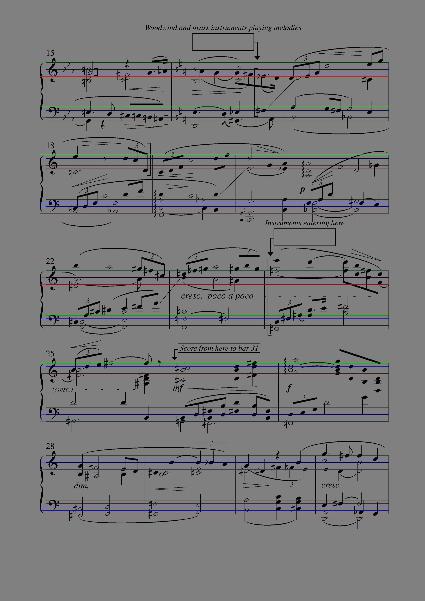

# AUTO-SCORE
auto-score is an Optical Music Recognition (OMR) program written in C++. It leverages classical computer vision algorithms along with modern deep learning models to recognize music notation from both computer generated and handwritten scores. It processes an input image and outputs a MusicXML file.

# Prerequisites
auto-score can, for the most part, process any type of musical. Nonetheless, there are a few prerequisites :
1. The input image was taken with a resolution of at least 2 megapixels.
2. The spacing between staffs is at least the staff height.
3. The musical notation is readable (very subjective).

## Modules
auto-score is made up of modules that each accomplish one specific task : 

1. Input : This module is the input of the whole program. It takes an image as an input and ouputs a straightened out and binarized version of it.
2. Staff : The binarized image is then scanned for staff line detection (start = green, end = red)

 

3. Model : This module slides an window along the staff lines to detect and classify relevant musical symbols.
4. Music : Finally, every detected symbol is processed within its context. The output is a MusicXML file.