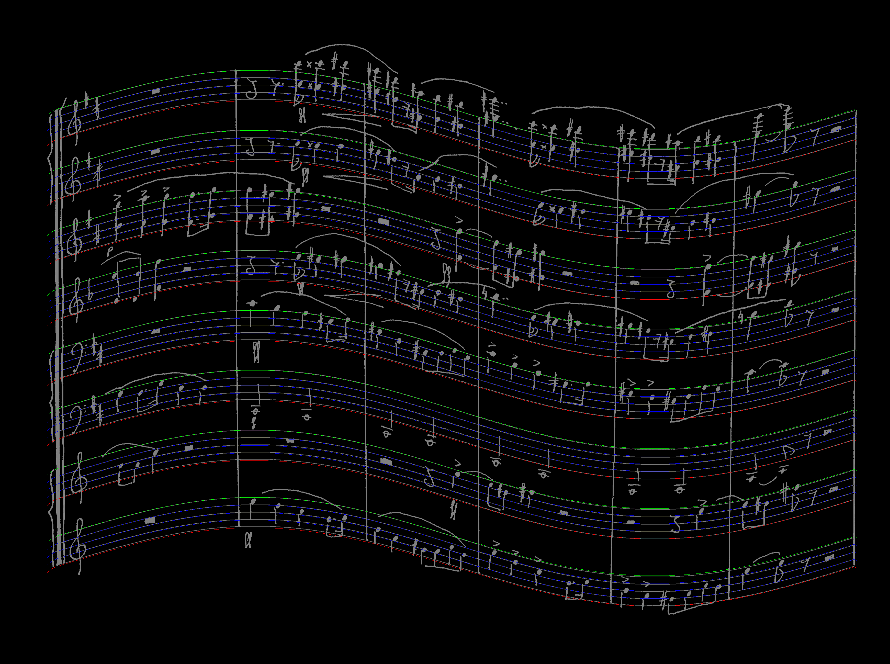
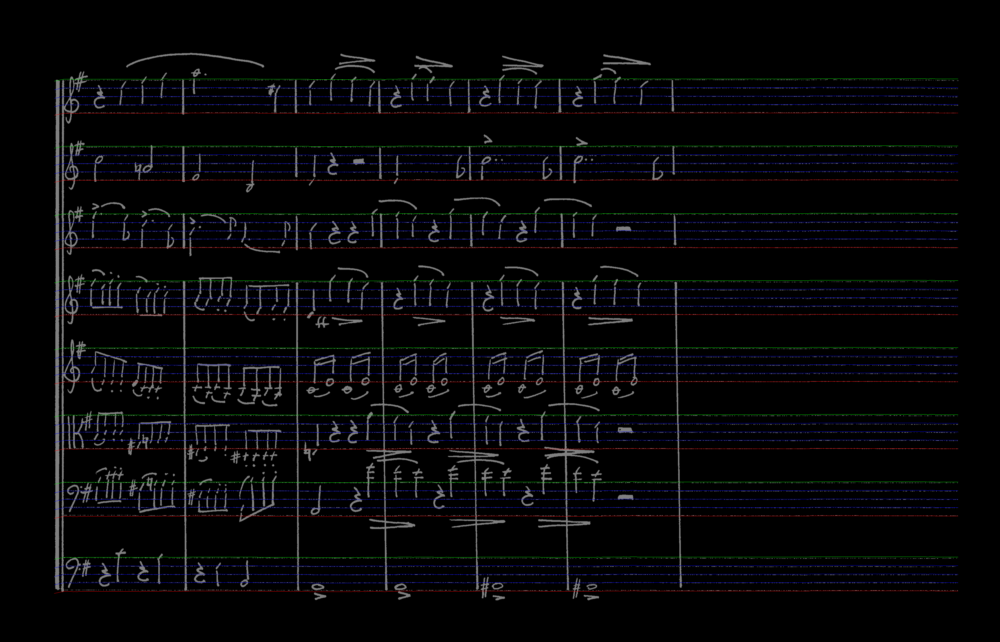

# AUTO-SCORE
auto-score is an Optical Music Recognition (OMR) program written in C++. It leverages classical computer vision algorithms along with modern deep learning models to recognize music notation from both computer generated and handwritten scores.

## Modules
auto-score is made up of modules that each accomplish one specific task : 

1. Input : This module is the input of the whole program. It takes an image as an input and ouputs a straightened out and binarized version of it.
2. Staff : The binarized image is then scanned for staff line detection. 
    
 
3. Model : This module slides an window along the staff lines to detect and classify relevant musical symbols.
4. Music : Finally, every detected symbol is processed within its context. The output is a MusicXML file.